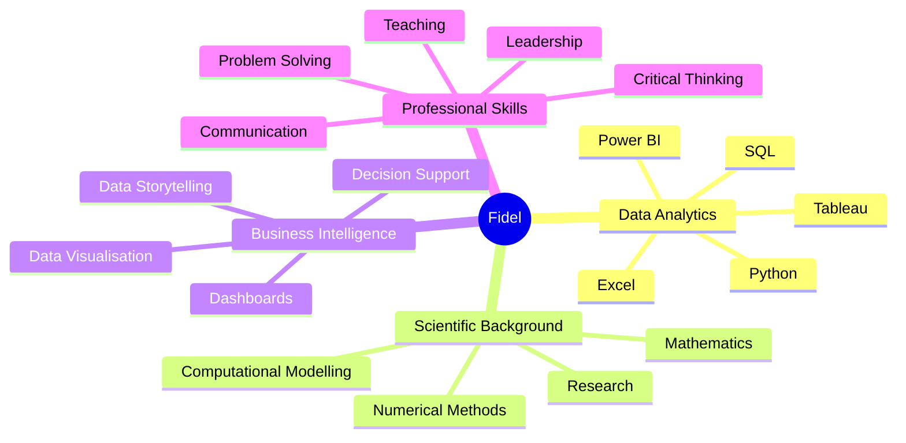

# Hey! Nice to see you 👋

### I'm Fidel Alejandro — Research Scientist transitioning into Data Analytics 📊

I hold a **PhD in Physical Chemistry** and have a background in scientific research, university teaching, mathematics, programming and computational modelling.

I am now applying that analytical experience to **business data analytics**, building practical projects with **Excel, SQL, Power BI, Tableau, Microsoft Azure and Python**.

I enjoy turning complex data into **clear, meaningful and actionable insights**.

---

### 🌍 Languages

🇪🇸 **Spanish** ★★★★★  
🇬🇧 **English** ★★★★☆  
🇫🇷 **French** ★★☆☆☆

---

### 📌 NOW

- 📚 Completing a **Data Technician Skills Bootcamp**
- 📊 Building my Data Analytics portfolio
- 🌱 Developing my skills in **SQL, Python, Power BI, Tableau and Azure**
- 🎯 Looking for opportunities as a **Data Analyst, Junior Data Analyst or Data Technician**
- 📍 Based in **Liverpool, United Kingdom**

---

## 👨‍💻 BIO

- 🧪 PhD in Physical Chemistry
- ⚛️ BSc in Nuclear Engineering
- 🔬 Former Newton International Fellow at the University of Bristol
- 👨‍🏫 Former university lecturer in Mathematics
- 💻 Background in Python, C++, Git and computational science
- 📊 Experience analysing complex scientific and quantitative datasets
- 🧠 Strong background in mathematics, numerical methods and problem-solving
- 📈 Interested in Data Analytics, Business Intelligence and AI
- 📚 Passionate about continuous learning, teaching and mentoring

---

## 🛠️ Data Analytics Toolkit

### 📊 Analytics & Business Intelligence

  
  
  

### 🗄️ Databases & Programming

<!-- This section is temporarily hidden -->

 <!--  -->
  
  
  
  
  
  
  

### ☁️ Cloud & Development

  
  
  
  

**Additional technical background:**  
`C++` · `Fortran` · `Google Colab` · `LaTeX` · `Gnuplot` · `Computational Modelling` · `Numerical Methods`

---

# 💡 What I Bring to Data Analytics

---

## 📂 Featured Data Projects

| Project | Focus |
|---|---|
| 📗 [**Excel Data Analysis**](https://github.com/FidelAlejandroData/Data-Technician-Bootcamp-Excel-Project) | Formulas, PivotTables, PivotCharts and sales analysis |
| 📊 [**Tableau Data Visualisation**](https://github.com/FidelAlejandroData/Data-Technician-Bootcamp-Tableau-Project) | Interactive dashboards and data storytelling |
| 📈 [**Power BI**](https://github.com/FidelAlejandroData/Data-Technician-Bootcamp-PowerBI-Project) | Power Query, DAX, data modelling and reporting |
| 🗄️ [**Databases & SQL**](https://github.com/FidelAlejandroData/Data-Technician-Bootcamp-Databases-SQL-Project) | SQL queries, JOINs and relational databases |
| ☁️ [**Microsoft Azure**](https://github.com/FidelAlejandroData/Data-Technician-Bootcamp-Azure-Project) | Azure data services, cloud concepts and Microsoft Fabric |
| 🐍 [**Python Data Analysis**](https://github.com/FidelAlejandroData/Data-Technician-Bootcamp-Python-Project) | Python, Pandas, DataFrames and visualisation |

---

## 🏅 Certifications & Additional Training

<b>🎓 View DataCamp certifications</b>

### 🗄️ SQL

- [**Introduction to SQL**](https://www.datacamp.com/completed/statement-of-accomplishment/course/b57798930b3041fb50e37266716d97f3961bee33?utm_medium=organic_social&utm_campaign=sharewidget&utm_content=soa)
- [**Intermediate SQL**](https://www.datacamp.com/completed/statement-of-accomplishment/course/99ce9a4f22474d933eba1981d06faca60d186335?utm_medium=organic_social&utm_campaign=sharewidget&utm_content=soa)
- [**Joining Data in SQL**](https://www.datacamp.com/completed/statement-of-accomplishment/course/b975050579e347545d313a33f7894f7e6e8503e9?utm_medium=organic_social&utm_campaign=sharewidget&utm_content=soa)
- [**Data Manipulation in SQL**](https://www.datacamp.com/completed/statement-of-accomplishment/course/bdcaed25416c3b95feb1ac0dee32adeb2efef920?utm_medium=organic_social&utm_campaign=sharewidget&utm_content=soa)

### 🐍 Python

- [**Introduction to Python**](https://www.datacamp.com/completed/statement-of-accomplishment/course/1844f1f18e46c042eae942a930600914b4c715d0?utm_medium=organic_social&utm_campaign=sharewidget&utm_content=soa)
- [**Intermediate Python**](https://www.datacamp.com/completed/statement-of-accomplishment/course/035b92cc2692735c854526ca7e20fd0655b4609d?utm_medium=organic_social&utm_campaign=sharewidget&utm_content=soa)
- [**Data Manipulation with pandas**](https://www.datacamp.com/completed/statement-of-accomplishment/course/d1998175deab4d0063a6023b2c2303d37ff8695e?utm_medium=organic_social&utm_campaign=sharewidget&utm_content=soa)

### 📊 Power BI

- [**Data Visualization in Power BI**](https://www.datacamp.com/completed/statement-of-accomplishment/course/ab76af7e16f8b2de682ef98100e59d1bd3d2351b?utm_medium=organic_social&utm_campaign=sharewidget&utm_content=soa)

### ☁️ Microsoft Azure & Cloud

- [**Understanding Cloud Computing**](https://www.datacamp.com/completed/statement-of-accomplishment/course/60bd107bcb646fc687916a2383bb21fd0a5e7265?utm_medium=organic_social&utm_campaign=sharewidget&utm_content=soa)
- [**Understanding Microsoft Azure**](https://www.datacamp.com/completed/statement-of-accomplishment/course/9d1944e4869d91f2dd9d28313f67487b0d1cc802?utm_medium=organic_social&utm_campaign=sharewidget&utm_content=soa)
- [**Understanding Microsoft Azure Architecture and Services**](https://www.datacamp.com/completed/statement-of-accomplishment/course/675f8851e4072b234c78e321a1e819a6c2c623c3?utm_medium=organic_social&utm_campaign=sharewidget&utm_content=soa)
- [**Understanding Microsoft Azure Management and Governance**](https://www.datacamp.com/completed/statement-of-accomplishment/course/b6975abae7040eb6837cb16e3991514f6d82bb6b?utm_medium=organic_social&utm_campaign=sharewidget&utm_content=soa)
- [**Microsoft Azure Fundamentals (AZ-900)**](https://www.datacamp.com/completed/statement-of-accomplishment/track/e767644044dfa18a7c6378abb08c63fdb07b0c6f?utm_medium=organic_social&utm_campaign=sharewidget&utm_content=soa)

---

## 🎯 What I'm Looking For

I am looking for opportunities where I can combine my **scientific research background, quantitative skills and modern data analytics toolkit** to help organisations make better data-driven decisions.

**Roles of interest:**  
`Data Analyst` · `Junior Data Analyst` · `Data Technician` · `Business Intelligence`

---

## 🤝 Connect With Me

---

> **From scientific research to data analytics — turning complex data into meaningful insights.**
