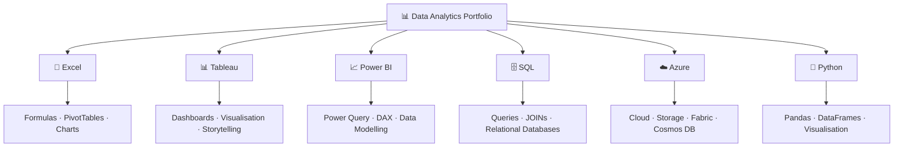
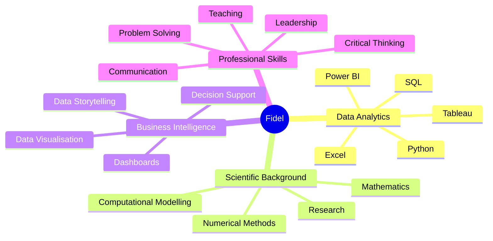

# Hi, I'm Fidel 👋

### 📊 Data Analyst | 🧪 Research Scientist | 💻 Python & SQL | 📈 Business Intelligence

I am a **research scientist and former university lecturer transitioning into Data Analytics**, with a PhD in Physical Chemistry and a strong background in mathematics, programming, computational modelling and quantitative analysis.

Over the past 15 years, I have worked across **higher education, scientific research and computational science** in Cuba, Mexico and the United Kingdom. My work has involved analysing complex datasets, developing scientific software, using computational models and communicating technical findings to multidisciplinary audiences.

I am currently developing my commercial data analytics skills through a **Data Technician Bootcamp**, where I have built practical projects using **Excel, SQL, Power BI, Tableau, Microsoft Azure and Python**.

My goal is to combine my scientific and analytical background with modern business intelligence tools to help organisations turn data into **clear, meaningful and actionable insights**.

---

## 🚀 My Journey into Data Analytics

My transition into data analytics builds directly on the skills I developed throughout my academic and research career:

* 🔢 Strong mathematical and quantitative background
* 🧠 Analytical and critical thinking
* 💻 Programming and computational modelling
* 📊 Working with large and complex datasets
* 🔍 Identifying patterns and interpreting results
* 🗣️ Communicating complex information clearly
* 🤝 Working in multidisciplinary and international teams

---

# 🛠️ Data Analytics Toolkit

## 📊 Business Intelligence & Visualisation

  
  
  

I use these tools to:

* Build interactive dashboards
* Analyse trends and business performance
* Create calculated fields and measures
* Develop PivotTables and analytical summaries
* Communicate findings through data storytelling

---

## 🗄️ Databases & SQL

  
  
  

I have practical experience with:

* `SELECT`
* `WHERE`
* `ORDER BY`
* `GROUP BY`
* Aggregate functions
* Subqueries
* SQL JOINs
* Relational database design
* Primary and foreign keys
* Entity Relationship Diagrams

---

## 🐍 Python & Data Analysis

  
  
  
  
  

I use Python for:

* Data manipulation
* Data cleaning
* Exploratory data analysis
* Filtering and aggregation
* Working with DataFrames
* Automating analytical tasks
* Data visualisation
* Scientific and numerical computing

---

## ☁️ Cloud & Microsoft Azure

  
  

I have developed practical knowledge of:

* Azure SQL Database
* Azure Storage
* Azure Cosmos DB
* Azure Data Factory
* Microsoft Fabric
* Lakehouse architecture
* Batch processing
* Stream processing
* Relational and non-relational data
* Cloud computing fundamentals

---

## 💻 Development & Technical Tools

  
  
  
  

My wider technical background also includes:

`Fortran` · `Mathematica` · `Gnuplot` · `LaTeX` · `Computational Modelling` · `Numerical Methods`

---

# 📁 Data Analytics Portfolio

My GitHub portfolio documents the projects I have completed while developing my practical data analytics skills.

## 📗 Excel Data Analysis

I used Excel to clean, organise and analyse **retail, customer and sales data**, using:

* Excel formulas
* `SUMIF` / `SUMIFS`
* `AVERAGEIF`
* `VLOOKUP`
* `SWITCH`
* PivotTables
* PivotCharts
* Conditional formatting
* Filters and slicers

---

## 📊 Tableau Data Visualisation

I created interactive dashboards using **Global Health and Spotify datasets**, applying:

* Calculated Fields
* Interactive filters
* Bar charts
* Line charts
* Pie charts
* Scatter plots
* Maps
* Treemaps
* Data storytelling

---

## 📈 Power BI

I worked through the complete Power BI analytical workflow:

My work included:

* Data cleaning and transformation
* Fact and dimension tables
* Data relationships
* DAX measures
* Interactive reports
* Business visualisations

---

## 🗄️ SQL & Databases

I developed relational database and SQL skills using **PostgreSQL and Supabase**, including:

* Query writing
* Filtering
* Sorting
* Aggregation
* Subqueries
* JOINs
* Database relationships
* ERD design

---

## ☁️ Microsoft Azure

I explored modern cloud data concepts and services including:

* Azure SQL Database
* Azure Storage
* Azure Cosmos DB
* Azure Data Factory
* Microsoft Fabric
* Data lakes
* Lakehouses
* Batch and streaming workloads

---

## 🐍 Python

I developed Python skills from programming fundamentals through to practical data analysis using Pandas.

My work included:

* Variables and data types
* Conditional logic
* Loops
* Collections
* Pandas DataFrames
* CSV analysis
* Filtering
* Aggregation
* Data manipulation
* Data visualisation

---

# 🏅 Certifications & Additional Training

Alongside my Data Technician Bootcamp, I have completed additional **DataCamp training** in SQL, Python, Power BI and Microsoft Azure.

## 🗄️ SQL

* 🎓 **Introduction to SQL**
* 🎓 **Intermediate SQL**
* 🎓 **Joining Data in SQL**
* 🎓 **Data Manipulation in SQL**

## 🐍 Python

* 🎓 **Introduction to Python**
* 🎓 **Intermediate Python**

## 📊 Power BI

* 🎓 **Data Visualization in Power BI**

## ☁️ Microsoft Azure & Cloud Computing

* ☁️ **Understanding Cloud Computing**
* 🔷 **Understanding Microsoft Azure**
* 🏗️ **Understanding Microsoft Azure Architecture and Services**
* ⚙️ **Understanding Microsoft Azure Management and Governance**
* 🎓 **Microsoft Azure Fundamentals (AZ-900)**

---

# 🌍 Languages

| Language | Proficiency |
|---|---|
| 🇪🇸 **Spanish** | ⭐⭐⭐⭐⭐ |
| 🇬🇧 **English** | ⭐⭐⭐⭐☆ |
| 🇫🇷 **French** | ⭐⭐☆☆☆ |

---

# 🎓 Academic & Scientific Background

My analytical background started long before my transition into commercial data analytics.

### 🧪 PhD in Physical Chemistry

**Autonomous University of the State of Morelos – Mexico**

My doctoral research involved:

* Quantum chemistry
* Numerical methods
* Computational modelling
* Electronic structure calculations
* Analysis of complex scientific data
* Python and Fortran

### ⚛️ BSc in Nuclear and Energy Technologies Engineering

**Higher Institute of Technologies and Applied Sciences – Cuba**

My degree provided a strong foundation in:

* Mathematics
* Physics
* Numerical methods
* Engineering modelling
* Programming
* Quantitative decision-making

### 🔬 Newton International Fellow – University of Bristol

During my research at the **University of Bristol**, I worked in theoretical and computational chemistry and contributed to scientific software development.

I used:

* C++
* Python
* Git
* Computational modelling
* Numerical simulations
* Scientific data analysis

---

# 💡 What I Bring to Data Analytics

My background allows me to approach data problems from both a **technical and analytical perspective**.

I bring:

* 🧠 Strong analytical and critical thinking
* 🔢 Advanced quantitative skills
* 🔍 Attention to detail
* 🧩 Structured problem-solving
* 📊 Data interpretation
* 🗣️ Technical and non-technical communication
* 👨‍🏫 Teaching and mentoring experience
* 🤝 International and multidisciplinary teamwork
* 📚 Continuous learning

---

# 🎯 Current Goal

I am currently looking for opportunities as a:

### 📊 Data Analyst  
### 📈 Junior Data Analyst  
### 💻 Data Technician

where I can combine my **scientific research experience, programming background and modern data analytics skills** to help organisations make informed, data-driven decisions.

I am particularly interested in continuing to develop within the **Data, Business Intelligence and AI sectors**.

---

# 🤝 Connect With Me

  
  
  

📍 **Liverpool, United Kingdom**

---

> 📊 **From scientific research to business analytics — using data to understand complex problems, communicate meaningful insights and support better decisions.**
